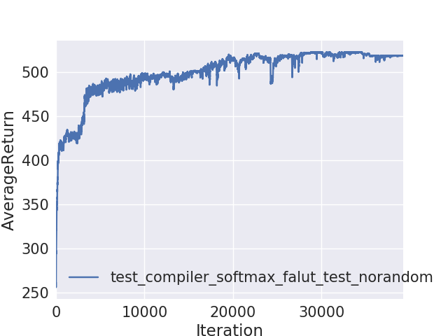

rlens: compiler optimization framework

Introduction

rLens is an compiler optimization framework via reinforcement learning. The project could optimize register allocation for graph computing like problem in different environment, such as compiler, deep learning framework. 

Register Allocation:
  1. allocate virtual register to physical register
  2. traditionally, it was np-complete problem with graph-color strategy

purpose:
  1. reduce data dependency
  2. target-dependent allocation strategy

usage:
  1. cd llvm && git checkout rpc && build [LLVM BUILD](https://llvm.org/docs/GettingStarted.html#compiling-the-llvm-suite-source-code)  
  2. llc -emit-llvm -S targetfile 
  3. mv targetfile program/
  4. modify src field of rlcofnig to  targetfile name  
  5. python train_pg.py CartPole-v0 -n 50000 -b 5000 -e 1 -rtg -dna --exp_name test_compiler_softmax_falut_test_norandom
  python train_pg.py -h for more information

Result:
  
reference:
  https://github.com/berkeleydeeprlcourse/homework 
